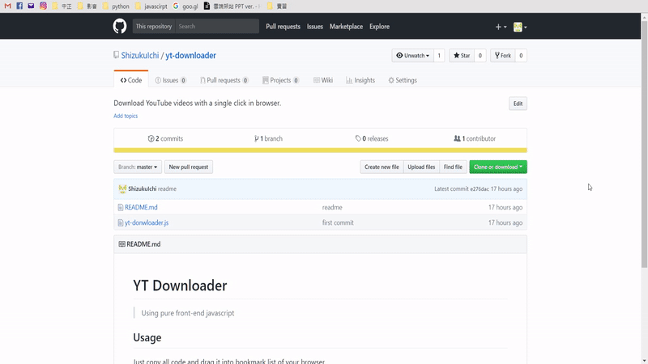

YT Downloader
===
> Using pure front-end javascript

## Usage

Just copy all code and drag it into bookmark list of your browser.  

  

Go to the website of the video you want to download and click the bookmark you just added.  

  

P.S. To download individual video, you should open a new tab. 